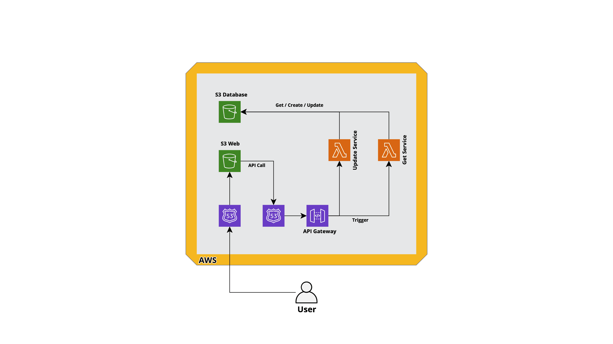

# YouGov Football

A test assignment from YouGov.

Personal goal is to treat the task as a "real" assignment but at the same time spend no more than ~4-6 hours on the task.

## Task

Take the following gist in consideration:
https://gist.github.com/joaofs/a6b80ce482de2f3846a00e72c0497a35

This is a list of premier league football teams. This is the dataset to be used during this
exercise. No actual database implementation is required, feel free to stub it out.

1. Create a REST API with the endpoint /teams returning the full dataset.
2. Create another action on /teams/{team_name} where {team_name} is the name of the
   team. If the team exists, should return only one record of the dataset.
3. Now, /teams should also be able to receive a payload allowing a team to be created.
4. On a different action, if a team already exists, /teams should update the image of the
   team.

## Requirements

- Keep it simple
- Low cost
- Serverless
- Clarity / Good documentation
- Quality

## Architecture

The goal is to build the system using AWS and serverless technologies. One important factor is also to try to use the same computer languages and technologies that is currently used in the existing [YouGov Chat][] application stack.

### Tech Stack

- **Terraform** to create the infrastructure.
- Use **Typescript** for the lambdas.
- **S3** as database for the JSON data.
- The web client use **S3** as a "web server".
- **Route 53** to serve both the web client and the API in order to be able to use a specific domain name.
- **OpenAPI** as a template for constructing the **API Gateway**.
- Use the **VUE** framework for the web client.

### Trade offs:

- Using only one repository for the backend, frontend and infrastructure.
- Run all tests and the deployment step locally.
- Local Terraform states.
- No security hardening.
- Web client is public.

## Budget

The table below show the budget for the required services on AWS. The cost for using Route 53 as DNS is not included since the domain is already in use. This budget is based on less than 100.000 requests/month and no more than 0.1 GB of data storage.

| Service     | Monthly Cost |
| ----------- | ------------ |
| Lambda      | $0.00        |
| S3          | $0.01        |
| API Gateway | $0.35        |
| Route 53    | $0.00        |
| **Total**   | **$0.36**    |

## Runbook

[YouGov Chat]: https://www.yougov.chat/

