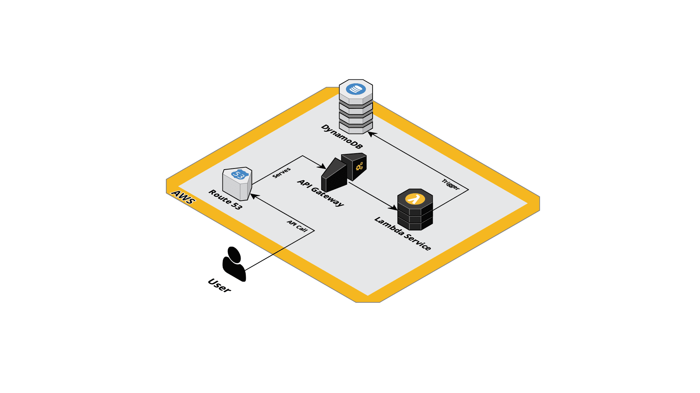

# YouGov Football

A test assignment from YouGov.

Personal goal is to treat the task as a "real" assignment but at the same time spend no more than ~4-6 hours on the task.

## Task

Take the following gist in consideration:
https://gist.github.com/joaofs/a6b80ce482de2f3846a00e72c0497a35

This is a list of premier league football teams. This is the dataset to be used during this
exercise. No actual database implementation is required, feel free to stub it out.

1. Create a REST API with the endpoint /teams returning the full dataset.
2. Create another action on /teams/{team_name} where {team_name} is the name of the
   team. If the team exists, should return only one record of the dataset.
3. Now, /teams should also be able to receive a payload allowing a team to be created.
4. On a different action, if a team already exists, /teams should update the image of the
   team.

## Requirements

- Keep it simple
- Low cost
- Serverless
- Clarity / Good documentation
- Quality

## Architecture

The goal is to build the system using AWS and serverless technologies. One important factor is also to try to use the same computer languages and technologies that is currently used in the existing [YouGov Chat][] application stack.

### Tech Stack

- [Terraform][] to create all the infrastructure.
- Use [Typescript][] for the lambdas.
- [Jest][] for the unit tests.
- [DynamoDB][] as database for the JSON data.
- ([OpenAPI][] as a template for constructing the [API Gateway][].)

### Trade offs:

- Using only one repository for the backend and infrastructure.
- Run all tests and the deployment step locally.
- Local Terraform states.
- No security hardening.
- API is public
- Not using X-Ray.

## Budget

The table below show the budget for the required services on AWS. The cost for using Route 53 as DNS is not included since the domain is already in use. This budget is based on less than 100.000 requests/month and no more than 0.1 GB of data storage.

| Service (1000 req/month) | Monthly Cost                  |
| ------------------------ | ----------------------------- |
| Lambda                   | $0.00                         |
| API Gateway              | $0.0035                       |
| DynamoDB                 | $1.6965                       |
| Route 53                 | $0.00                         |
| **Total**                | **$1.70** ($0 with free tier) |

## Runbook

### Configure AWS Lambda source

1. run `npm init` in src directory
2. `npm run test` for unit tests
3. In order to deploy run `npm run build`

### Deploy Infrastructure

1. Move to the relevant **stage folder**. (The only existing stage environment is *stage-jonas* but it's easy to create new stages using the current stage as a template)
2. Initialize `terraform init ../src`
3. Plan `terraform plan -out plan ../src`
4. If all looks great apply `terraform apply plan`

Any name is valid for the plan but "plan" is `.gitignored`

Infrastructure **not** created by terraform:

- The ACM certificate used for the domain since there already was one present.
- The parent domain *codeautomata.com* since it was already configured in Route 53.

### API

The application uses REST calls to get and create football teams.

Some tools you can use is **Curl** or **Postman**.

| Resource        | Method | Description                                                  |      |
| --------------- | ------ | ------------------------------------------------------------ | ---- |
| /teams          | GET    | All teams will be returned                                   |      |
| /teams          | POST   | A new team will be updated except if the name already exist then it will update the image on the existing team. |      |
| /teams/`{name}` | GET    | Will return the team that is found using the `{name}` path parameter.  Some values to try are `Liverpool`, `Arsenal` and `Manchester%20United`. The `{name}` parameter must be in a **URL encoded** format. |      |

### Online Test Environment

The application can be tested on: [https://api.yougov.codeautomata.com/](https://api.yougov.codeautomata.com/)

[YouGov Chat]: https://www.yougov.chat/
[Jest]: https://jestjs.io
[Terraform]: https://www.terraform.io
[OpenAPI]: https://www.openapis.org
[Typescript]: https://www.typescriptlang.org
[DynamoDB]: https://aws.amazon.com/dynamodb/
[API Gateway]: https://aws.amazon.com/api-gateway/